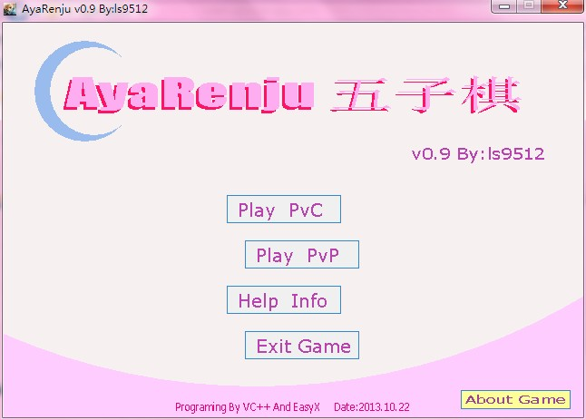
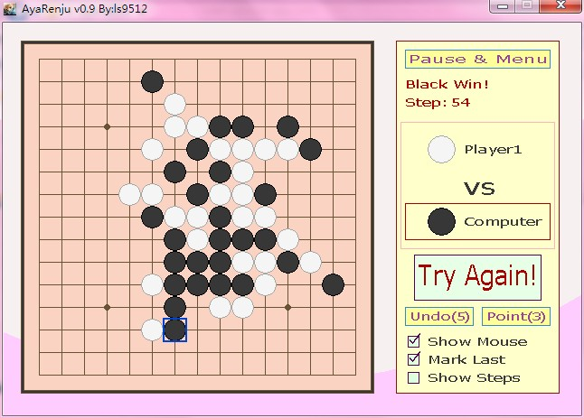
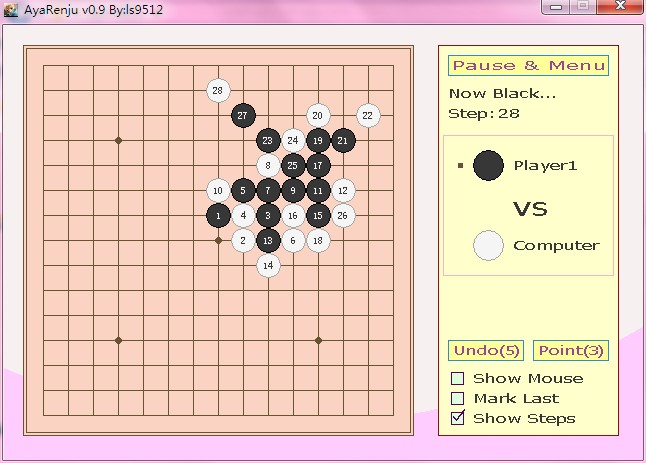
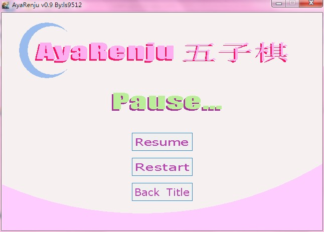
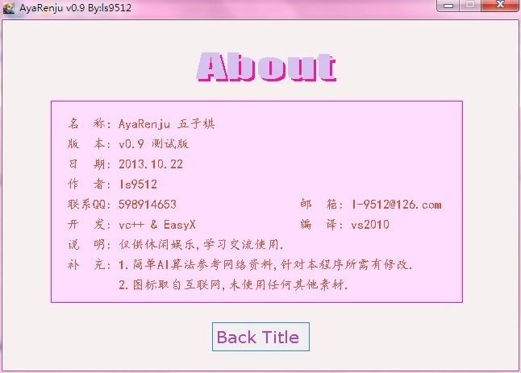

# Aya RenJu

🎮 **Aya RenJu** is a **RenJu** game implemented using **EasyX**, designed for learning basic C++ programming and the use of the EasyX graphics library.It includes simple player-versus-AI and player-versus-player modes.

